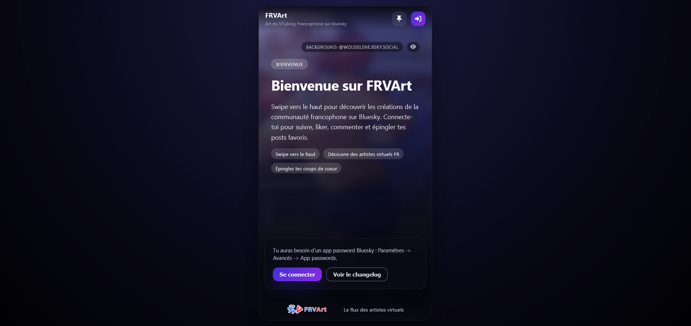

# FRVArt



[:computer: Releases](https://github.com/jojo58fr/FRVArt/releases) | [:bug: Report an issue](https://github.com/jojo58fr/FRVArt/issues)

FRVArt est une vitrine communautaire open source dediee aux creations VTubing francophones publiees sur Bluesky. L'application presente un flux type TikTok optimise pour l'exploration rapide des oeuvres, avec epingles locales, panneau de commentaires, et outils de partage.

## Version
- Version actuelle : **1.1.0** (Octobre 2024). Voir [client/CHANGELOG.md](client/CHANGELOG.md) pour la liste complete des evolutions.

## Fonctionnalites principales
- Flux d'art dynamique filtre sur les hashtags #FRVArt et #VtuberFR.
- Experience onboarding pour les visiteurs non connectes.
- Connexion Bluesky via app password avec gestion optionnelle de la session locale.
- Galerie d'epingles en local pour conserver ses coups de coeur.
- Panneau de commentaires, partage rapide, et suivi des artistes.
- Changelog integre, maintenant genere automatiquement depuis `client/CHANGELOG.md`.

## Stack technique
- React 18 + Vite pour le bundling.
- PrimeReact, PrimeFlex et FontAwesome pour les composants UI.
- API officielle Bluesky via `@atproto/api`.
- Stockage local pour les epingles et la session Bluesky.

## Prerequis
- Node.js 18+ (recommande) et npm 9+.
- Un compte Bluesky avec app password pour beneficier des fonctions connectees.

## Installation
```bash
git clone https://github.com/jojo58fr/FRVArt.git
cd FRVArt/client
npm install
```

## Lancement en developpement
```bash
npm run dev
```
Le serveur Vite affiche l'URL locale dans la console (par defaut http://localhost:5173). Les sessions Bluesky sont persistees en local par defaut; cochez "Ne pas se souvenir de moi" dans le dialogue de connexion pour desactiver cette persistance.

## Build de production
```bash
npm run build
npm run preview
```

## Scripts npm utiles
- `npm run dev` : lance Vite en mode developpement.
- `npm run build` : compile TypeScript et genere les assets de production.
- `npm run preview` : previsualise le build de production.
- `npm run lint` : execute ESLint sur l'ensemble du projet.

## Organisation du projet
```
client/
  src/
    components/      Composants React reutilisables (dialogues, cartes, navbars)
    data/            Donnees partagees (onboarding, changelog)
    services/        Integrations Bluesky et caches locaux
    utils/           Fonctions d'aide pour le flux
  CHANGELOG.md       Historique des versions (source du dialogue Changelog)
  metadata-version.json
  package.json
README.md            (ce fichier)
CONTRIBUTING.md      Guide de contribution
```

## Changelog
Les nouveautes sont maintenues dans [`client/CHANGELOG.md`](client/CHANGELOG.md). Chaque contribution significative doit ajouter une entree dans ce fichier.

## Contribution
Les contributions sont les bienvenues. Merci de consulter le guide [CONTRIBUTING.md](CONTRIBUTING.md) pour le detail du flux de travail, des normes de code et des attentes en matiere de tests.

## Support et communautes
- Bluesky : https://bsky.app/profile/frvtubers.com
- Discord FRVtubers : https://discord.gg/meyHQYWvjU

## Contributing & Support
- Suggestions / issues: https://github.com/jojo58fr/FRVArt/issues
- Contact Discord: TakuDev
- Contact: Joachim Miens – contact@joachim-miens.com

## Licence
La licence est sous GPLV3. Vous pouvez consulter la licence complète ici: [LICENCE.md](LICENCE.md). Un résumé de la licence se trouve ici: [GPLV3.md](GPLV3.md)
